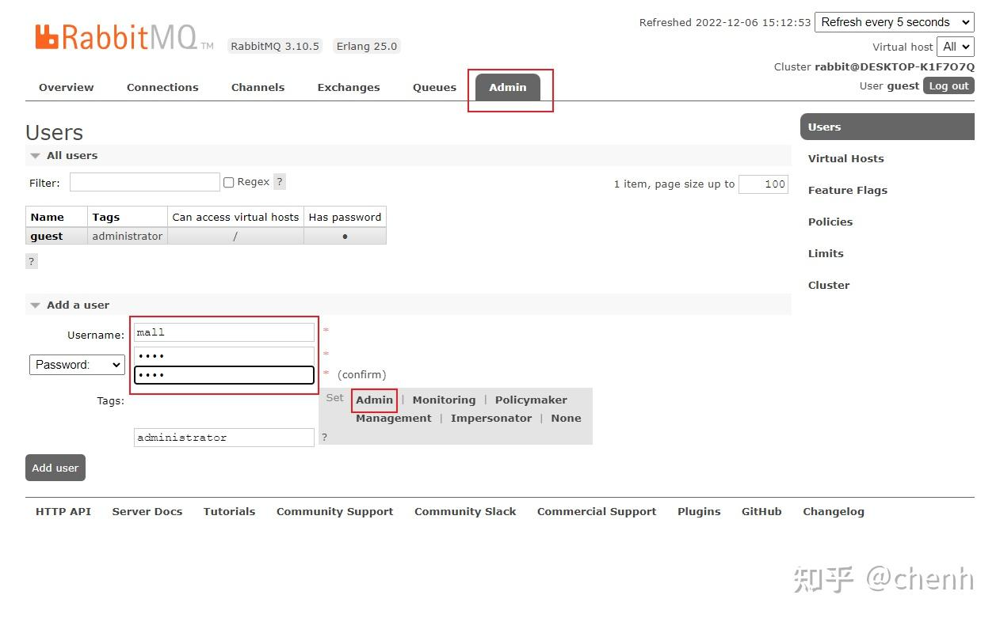
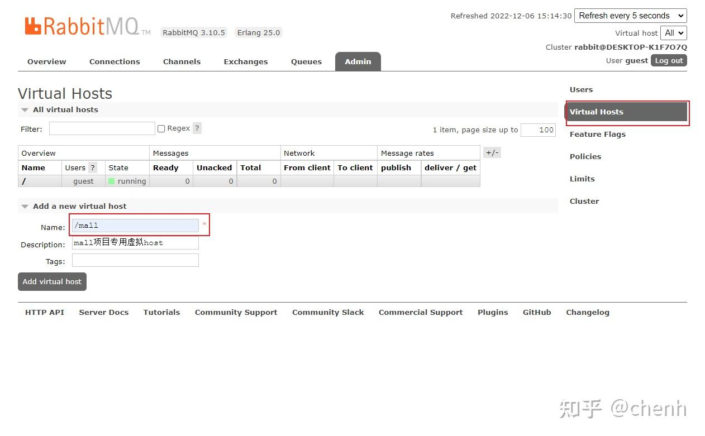
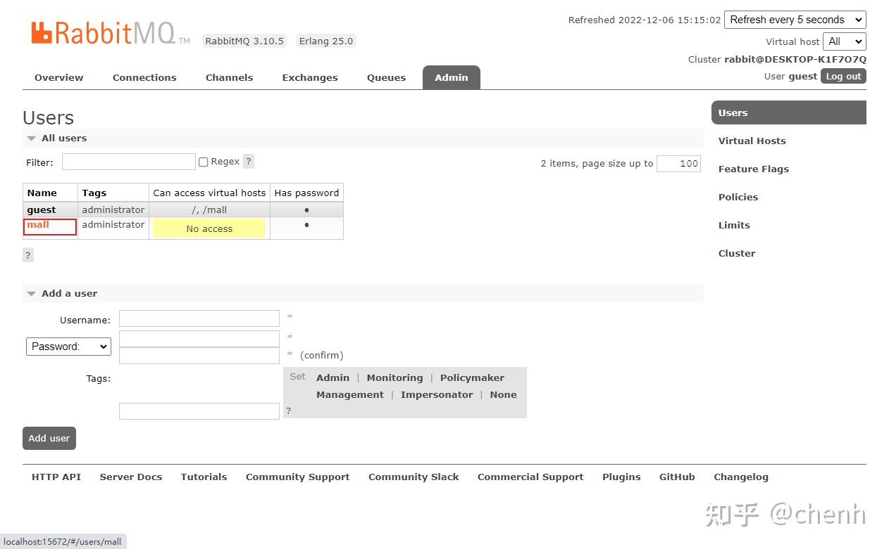
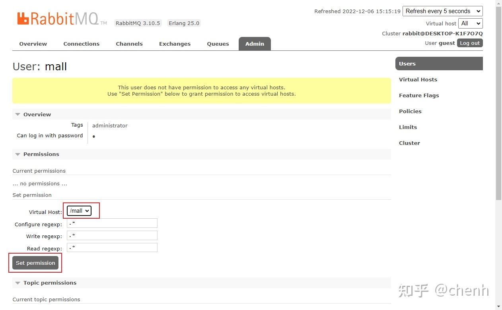
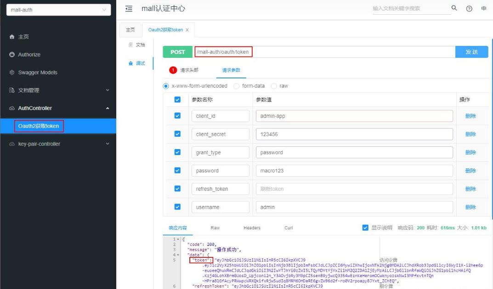
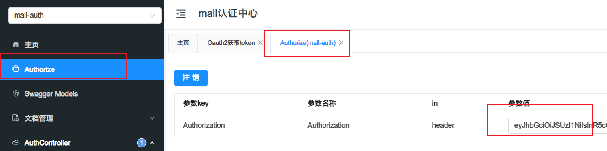

**MongoDB**


**RabbitMQ**

1,RabbitMQ创建帐号mall:mall，并设置其角色为管理员；

2,创建一个新的虚拟host为，名称为/mall；

3,点击mall用户进入用户配置页面；

给mall用户配置该虚拟host的权限，至此，RabbitMQ的配置完成。


**ELK**
ES 需要安装ik分词器


### 安装完毕

运行完成后可以通过监控中心查看监控信息，账号密码为macro:123456：http://localhost:8101

运行完成后可以直接通过如下地址访问API文档：http://localhost:8201/doc.html

如何访问需要登录的接口，先调用认证中心接口获取token，后台管理client_id和client_secret为admin-app:123456，前台系统为portal-app:123456；

然后将token添加到请求头中，即可访问需要权限的接口了。



admin页面 admin:123456

```shell
文档：http://localhost:8201/doc.html
监控中心:http://localhost:8101

```
